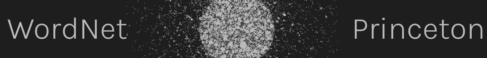

# WordNet Princeton Education Scrapper to convert everything they have into .md files which can be read by obsidian.md

## TLDR;
- clone repo
- cd inside repo
- run `python init.py`
- run `wordnet_to_markdown.py`
- look inside new folder `/wordnet_markdown`

## What have I done?

I found out about KnowledgeGraphs and Knowledge Bases because of obsidian.md.
This concept fascinates me and I tried to get my hands on some kind of public knowledge base.
I figured out, when I use the data from [WordNet Princton](https://wordnet.princeton.edu/) as my base, I could format the data until I have my desired format, mainly obsidian.md friendly.
This means, that links are represented by `[[ Link to Titel ]]` and multiple links can lead to the same titel by `[[ Other Link to Titel | Link to Titel ]]`.

This README.md file contains in it's first commit all the necessary steps I took, to finish this application.

## How does it look like?
Like this:


## The Regret <(Ôºø„ÄÄÔºø)>
Ok, after revising the story, i figured out that I don't actually use the [WordNet Princton](https://wordnet.princeton.edu/), as I thought.
It seems, that `nltk` can download `wordnet`, which is kind of a lexica (lexicons, lexiconos, lexicara).
So the Image of the Knowledge Graph above is just a "simple" lexica. Still, very impressive so far ^^
I wanna see if I can add the "princeton" wordnet data into the semantic network.
But before that I found out, that the naming of the markdown files is kinda 'whacky' so, first fix that and then adding the princeton knowledge to the mix. Brrrrrrrrrrr üî•üî•üî•

## The Story

[ Cutmasta-Kun ]

Wie nennt man den Graphen, der dabei entsteht, wenn man ein ausführliches semantisches Netzwerk auf Basis einer großen Knowledge Base erstellen würde?

[ Helper-Chan ]

Ein umfangreiches semantisches Netzwerk, das auf Basis einer großen Knowledge Base erstellt wird, kann als "Wissensgraph" (engl. "knowledge graph") bezeichnet werden. Wissensgraphen repräsentieren strukturiertes Wissen aus verschiedenen Quellen in Form von Knoten (Entitäten oder Konzepte) und Kanten (Beziehungen zwischen diesen Entitäten). Sie sind eine wichtige Methode zur Organisation, Integration und Visualisierung von Wissen in einer leicht verständlichen und nutzbaren Form.

Wissensgraphen werden in verschiedenen Bereichen eingesetzt, wie zum Beispiel im Semantic Web, bei der Entwicklung von Künstlicher Intelligenz (KI) und im Bereich der Datenintegration. Ein bekanntes Beispiel für einen Wissensgraphen ist der Google Knowledge Graph, der Informationen aus vielen verschiedenen Quellen integriert, um Nutzern kontextbezogene und relevante Informationen zu bieten.

Die Erstellung eines Wissensgraphen aus einer großen Knowledge Base erfordert Techniken aus den Bereichen Datenextraktion, Datenintegration, Ontologie-Entwicklung und maschinelles Lernen. Darüber hinaus sind auch Technologien wie RDF (Resource Description Framework) und OWL (Web Ontology Language) für die Repräsentation von Wissen und das Definieren von Beziehungen und Hierarchien zwischen den Konzepten in einem Wissensgraphen von Bedeutung.

[ Cutmasta-Kun ]

Da Wissensgraphen mithilfe von Markdown Knowledge Bases erstellt werden können (mit Markdown kann man sehr gut verknüpfungen und relationen erstellen), gibt es bereits Versuche um die Wissenschaft in form von einer knowledge base darzustellen?

[ Helper-Chan ]

Es gibt zwar keine direkte Verbindung zwischen Markdown und Wissensgraphen, aber ich verstehe, was Sie meinen: Mithilfe von Markdown kann man leicht verknüpfte Dokumente erstellen, die zu einer strukturierten Darstellung von Wissen führen können. Tatsächlich gibt es mehrere Projekte und Initiativen, die darauf abzielen, wissenschaftliches Wissen in Form von Knowledge Bases oder Wissensgraphen darzustellen und zugänglich zu machen. Einige Beispiele sind:

1. WikiPathways (https://www.wikipathways.org/): WikiPathways ist ein Open-Source-Projekt, das darauf abzielt, biologische Signalwege als verknüpfte Entitäten in einer Knowledge Base darzustellen. Es ermöglicht Forschern, Signalwege zu erstellen, zu bearbeiten und zu teilen.

2. DBpedia (https://dbpedia.org/): DBpedia ist ein Gemeinschaftsprojekt, das darauf abzielt, strukturierte Informationen aus der Wikipedia in Form eines Wissensgraphen bereitzustellen. DBpedia extrahiert strukturierte Daten aus Wikipedia und stellt sie als RDF-Tripel zur Verfügung, die in semantischen Anwendungen und KI-Systemen verwendet werden können.

3. Semantic Scholar (https://www.semanticscholar.org/): Semantic Scholar ist eine wissenschaftliche Suchmaschine, die KI-Techniken verwendet, um wissenschaftliche Literatur besser durchsuchbar und zugänglich zu machen. Es extrahiert und organisiert Informationen aus wissenschaftlichen Publikationen und präsentiert sie in einer strukturierten und verknüpften Form.

4. OpenCyc (http://www.opencyc.org/): OpenCyc ist ein Open-Source-Projekt, das darauf abzielt, eine umfassende Ontologie und eine Knowledge Base für allgemeines Wissen zu erstellen. Es enthält Millionen von Konzepten und Beziehungen aus verschiedenen Wissensdomänen, darunter auch wissenschaftliche Bereiche.

Diese Projekte und Initiativen zeigen, dass es Bestrebungen gibt, wissenschaftliches Wissen in strukturierten und verknüpften Formaten zu präsentieren. Obwohl die meisten dieser Projekte nicht direkt auf Markdown basieren, nutzen sie ähnliche Prinzipien, um Wissen auf eine Weise zu organisieren und darzustellen, die für Mensch und Maschine leicht zugänglich und verständlich ist.

[ Cutmasta-Kun ]

Hm, diese 4 vorschläge konnten mir leider nicht helfen :-(
Wenn ich wenigstens eine knowledge base in IRGEND einem Format runterladen könnte, dann könnte ich es ja vielleicht noch zu Markdown umformatieren, aber ich finde nichts öffentlich, community-driven oder open-source mässiges dazu

[ Helper-Chan ]

Es tut mir leid, dass die vorgeschlagenen Projekte nicht hilfreich waren. Hier sind einige weitere Ressourcen, die als Knowledge Bases dienen können und die Möglichkeit bieten, sie herunterzuladen oder auf ihre Daten zuzugreifen:

1. Wikidata (https://www.wikidata.org/): Wikidata ist eine offene und gemeinschaftlich erstellte Knowledge Base, die von der Wikimedia Foundation betrieben wird. Es enthält strukturierte Daten aus verschiedenen Quellen, einschließlich Wikipedia. Sie können einen Daten-Dump von Wikidata herunterladen (https://www.wikidata.org/wiki/Wikidata:Database_download) und versuchen, diese Daten in das gewünschte Format zu konvertieren.

2. Freebase (https://developers.google.com/freebase/): Freebase war eine offene und gemeinschaftlich erstellte Knowledge Base, die strukturierte Daten aus verschiedenen Quellen sammelte. Obwohl Freebase inzwischen eingestellt wurde, sind die Daten weiterhin als Daten-Dumps verfügbar (https://developers.google.com/freebase/data). Diese Daten könnten als Ausgangspunkt für die Erstellung einer eigenen Knowledge Base im gewünschten Format dienen.

3. ConceptNet (http://conceptnet.io/): ConceptNet ist ein semantisches Netzwerk, das allgemeines Wissen repräsentiert und von mehreren Projekten und Organisationen gemeinschaftlich erstellt wurde. ConceptNet stellt seine Daten sowohl über eine API als auch als Daten-Dumps (http://conceptnet.io/downloads) zur Verfügung. Sie können diese Daten verwenden, um eine eigene Knowledge Base im gewünschten Format zu erstellen.

4. WordNet (https://wordnet.princeton.edu/): WordNet ist eine große lexikalische Datenbank der englischen Sprache, die von der Princeton University entwickelt wurde. WordNet organisiert englische Wörter in Synsets (Synonymmengen) und stellt Beziehungen zwischen diesen Synsets her. WordNet kann als Knowledge Base verwendet werden, und es ist möglich, die Daten herunterzuladen (https://wordnet.princeton.edu/download) und in ein anderes Format zu konvertieren.

Diese Ressourcen bieten verschiedene Formate und Datensätze, die als Ausgangspunkt für die Erstellung einer eigenen Knowledge Base dienen können. Die Konvertierung dieser Daten in das Markdown-Format erfordert möglicherweise zusätzliche Arbeit, wie das Schreiben von Skripten oder die Verwendung von Tools zur Datenkonvertierung. Dennoch sollten diese Ressourcen Ihnen helfen, einen geeigneten Datensatz für Ihre Zwecke zu finden.

[ Cutmasta-Kun ]

Ok, ich habe mir die daten von wordnet.princeton.edu runtergeladen. Ich würde diese jetzt gerne in ein Markdown format konvertieren.

[ Helper-Chan ]

Um die WordNet-Daten in das Markdown-Format zu konvertieren, können Sie ein Skript oder ein Programm schreiben, das die Daten liest und sie in die gewünschte Markdown-Struktur umwandelt. Eine Möglichkeit, dies zu tun, ist die Verwendung von Python und einer Bibliothek wie NLTK (Natural Language Toolkit), die eine Schnittstelle zu WordNet bereitstellt. Hier ist ein einfaches Beispiel, wie Sie ein Python-Skript erstellen können, um WordNet-Daten im Markdown-Format zu generieren:

1. Installieren Sie Python (falls noch nicht geschehen) von https://www.python.org/downloads/.
2. Installieren Sie NLTK, indem Sie das Terminal (oder die Eingabeaufforderung unter Windows) öffnen und den folgenden Befehl eingeben:
``` bash
pip install nltk
```
3. Führen Sie anschließend Python aus und laden Sie den WordNet-Korpus mit den folgenden Befehlen:
``` python
import nltk
nltk.download('wordnet')
```
4. Erstellen Sie ein Python-Skript (z.B. wordnet_to_markdown.py) und fügen Sie den folgenden Code ein:
``` python
import os
from nltk.corpus import wordnet as wn

output_directory = "wordnet_markdown"

if not os.path.exists(output_directory):
    os.makedirs(output_directory)

synsets = list(wn.all_synsets())

for synset in synsets:
    filename = f"{output_directory}/{synset.name()}.md"
    with open(filename, "w", encoding="utf-8") as f:
        # Schreiben Sie die √úberschrift (Synset-ID und Wortart)
        f.write(f"# {synset.name()} ({synset.pos()})\n\n")
        
        # Schreiben Sie die Definition
        f.write(f"**Definition:** {synset.definition()}\n\n")

        # Schreiben Sie die Beispiele (falls vorhanden)
        if synset.examples():
            f.write("**Examples:**\n\n")
            for example in synset.examples():
                f.write(f"- {example}\n")
            f.write("\n")

        # Schreiben Sie die Synonyme (Lemmata)
        f.write("**Synonyms:**\n\n")
        for lemma in synset.lemmas():
            f.write(f"- {lemma.name()}\n")
        f.write("\n")

        # Schreiben Sie die Hypernym-Beziehungen (Oberbegriffe)
        hypernyms = synset.hypernyms()
        if hypernyms:
            f.write("**Hypernyms:**\n\n")
            for hypernym in hypernyms:
                f.write(f"- [{hypernym.name()}]({hypernym.name()}.md)\n")
            f.write("\n")

        # Schreiben Sie die Hyponym-Beziehungen (Unterbegriffe)
        hyponyms = synset.hyponyms()
        if hyponyms:
            f.write("**Hyponyms:**\n\n")
            for hyponym in hyponyms:
                f.write(f"- [{hyponym.name()}]({hyponym.name()}.md)\n")
            f.write("\n")
```
5. Führen Sie das Skript aus, indem Sie das Terminal (oder die Eingabeaufforderung unter Windows) öffnen und den folgenden Befehl eingeben:
``` bash
python wordnet_to_markdown.py
```
Dieses Skript generiert Markdown-Date[...connection lost]

---

[I downloaded python3 and pip3, ran python using the python command line, pasted the first python script provided by Helper-Chan and afterwards created a file `wordnet_to_markdown.py` in which I pasted the contend of the last python script. I ran `python3 wordnet_to_markdown.py` but I got an error. Still this script created a folder `/wordnet_-_markdown` and started saving .md files. Now I needed to get rid of the Error]

---

[ Cutmasta-Kun ]

Vielen Dank für die Ausführliche Antwort! Ich habe folgenden Fehler in meiner ZSH Konsole zurückbekommen, nachdem ich das script mit "python3 wordnet_to_markdown.py" ausgeführt habe:
```
Traceback (most recent call last):
  File "wordnet_to_markdown.py", line 13, in <module>
    with open(filename, "w", encoding="utf-8") as f:
FileNotFoundError: [Errno 2] No such file or directory: 'wordnet_markdown/lo/ovral.n.01.md'
```

[ Helper-Chan ]

Entschuldigung für die Unannehmlichkeiten. Der Fehler wird durch Schrägstriche in den Synset-Namen verursacht, die in Dateinamen nicht zulässig sind. Sie können das Problem beheben, indem Sie die Schrägstriche in den Synset-Namen durch Unterstriche ersetzen. Hier ist der aktualisierte Code, der dieses Problem beheben sollte:

``` python
import os
from nltk.corpus import wordnet as wn

output_directory = "wordnet_markdown"

if not os.path.exists(output_directory):
    os.makedirs(output_directory)

synsets = list(wn.all_synsets())

for synset in synsets:
    sanitized_name = synset.name().replace("/", "_")
    filename = f"{output_directory}/{sanitized_name}.md"
    with open(filename, "w", encoding="utf-8") as f:
        # Schreiben Sie die √úberschrift (Synset-ID und Wortart)
        f.write(f"# {sanitized_name} ({synset.pos()})\n\n")
        
        # Schreiben Sie die Definition
        f.write(f"**Definition:** {synset.definition()}\n\n")

        # Schreiben Sie die Beispiele (falls vorhanden)
        if synset.examples():
            f.write("**Examples:**\n\n")
            for example in synset.examples():
                f.write(f"- {example}\n")
            f.write("\n")

        # Schreiben Sie die Synonyme (Lemmata)
        f.write("**Synonyms:**\n\n")
        for lemma in synset.lemmas():
            f.write(f"- {lemma.name()}\n")
        f.write("\n")

        # Schreiben Sie die Hypernym-Beziehungen (Oberbegriffe)
        hypernyms = synset.hypernyms()
        if hypernyms:
            f.write("**Hypernyms:**\n\n")
            for hypernym in hypernyms:
                sanitized_hypernym_name = hypernym.name().replace("/", "_")
                f.write(f"- [{sanitized_hypernym_name}]({sanitized_hypernym_name}.md)\n")
            f.write("\n")

        # Schreiben Sie die Hyponym-Beziehungen (Unterbegriffe)
        hyponyms = synset.hyponyms()
        if hyponyms:
            f.write("**Hyponyms:**\n\n")
            for hyponym in hyponyms:
                sanitized_hyponym_name = hyponym.name().replace("/", "_")
                f.write(f"- [{sanitized_hyponym_name}]({sanitized_hyponym_name}.md)\n")
            f.write("\n")
```

Führen Sie das aktualisierte Skript aus, und es sollte ohne Fehler funktionieren.

[ Cutmasta-Kun ]

Wäre es möglich, dass wir die Art der verknüpfung in den markdown dateien überarbeiten?
Ich hätte gerne, dass die Verknüpfung so dargestellt wird, dass vom ausgangsdokument durch ein `[[]]` auf den Titel hingewiesen wird, zum Beispiel `[[Titel]]`. Da der Titel der selbe sein sollte, wie der Dateiname, kann obsidian.md dass dann lesen. 
Außerdem können semantisch gleiche Inhalte auf selbe Dateien zeigen, indem die Syntax von `[[]]` durch ein ` | ` erweitert wird. Zum Beispiel `[[Titel | Ähnlicher Titel]]`. In Obsidian.md wird dann nur "Ähnlicher Titel" angezeigt aber eigentlich mit "Titel" verknüpft.
Wäre das möglich?

[ Helper-Chan ]

Natürlich ist das möglich! Hier ist der aktualisierte Code, der die Verknüpfungen in Obsidian-kompatiblen Markdown-Formaten erstellt:

``` python
import os
from nltk.corpus import wordnet as wn

output_directory = "wordnet_markdown"

if not os.path.exists(output_directory):
    os.makedirs(output_directory)

synsets = list(wn.all_synsets())

for synset in synsets:
    sanitized_name = synset.name().replace("/", "_")
    filename = f"{output_directory}/{sanitized_name}.md"
    with open(filename, "w", encoding="utf-8") as f:
        # Schreiben Sie die √úberschrift (Synset-ID und Wortart)
        f.write(f"# {sanitized_name} ({synset.pos()})\n\n")
        
        # Schreiben Sie die Definition
        f.write(f"**Definition:** {synset.definition()}\n\n")

        # Schreiben Sie die Beispiele (falls vorhanden)
        if synset.examples():
            f.write("**Examples:**\n\n")
            for example in synset.examples():
                f.write(f"- {example}\n")
            f.write("\n")

        # Schreiben Sie die Synonyme (Lemmata)
        f.write("**Synonyms:**\n\n")
        for lemma in synset.lemmas():
            f.write(f"- {lemma.name()}\n")
        f.write("\n")

        # Schreiben Sie die Hypernym-Beziehungen (Oberbegriffe)
        hypernyms = synset.hypernyms()
        if hypernyms:
            f.write("**Hypernyms:**\n\n")
            for hypernym in hypernyms:
                sanitized_hypernym_name = hypernym.name().replace("/", "_")
                f.write(f"- [[{sanitized_hypernym_name}]]\n")
            f.write("\n")

        # Schreiben Sie die Hyponym-Beziehungen (Unterbegriffe)
        hyponyms = synset.hyponyms()
        if hyponyms:
            f.write("**Hyponyms:**\n\n")
            for hyponym in hyponyms:
                sanitized_hyponym_name = hyponym.name().replace("/", "_")
                f.write(f"- [[{sanitized_hyponym_name}]]\n")
            f.write("\n")
```
Dieser Code verwendet nun die [[Titel]]-Syntax für die Verknüpfungen und sollte mit Obsidian kompatibel sein. Um den alternativen Titel zu verwenden, können Sie den Code einfach anpassen und [[Titel | Ähnlicher Titel]] verwenden, wo immer Sie möchten, dass ein alternativer Titel angezeigt wird.f

---

[At this point it seemed to be working and I'm trying to get 100.000 Files from my wsl2 instance into my windows folder system, so that obsidian.md can access it. If this doesn't work, I'll try to get obsidian.md in ubuntu running and start it from there 🤔]

[ Ok, the approach with installing obsidian.md in ubuntu via snap didn't work at all -.- I figured out how to install obsidian.md with a .snap file, but i wasn't able to open obsidian.md inside the ubuntu partition. But I took the bruteforce attempt and copied all the generated .md files from my ubuntu partition to my windows desktop.
This took AAAAAAAAAAAAGES (while I was waiting, continued the video ["Donald Hoffman: Reality is an Illusion - How Evolution Hid the Truth | Lex Fridman Podcast"](https://www.youtube.com/watch?v=reYdQYZ9Rj4)).
But it did work! only 2 files were not possible to copy, but I can look into that later. Concidering, that I have now ~117.000 .md files, waiting to be analyzed!
At the Moment, I opened the folder as a vault in obsidian and am waiting for obsidian.md to index all the files in the vault. Afterwards, let's take a look on the KnowledgeGraph ‚ô• ]

[After I looked ca. 50 times over this repo, I figured more stuff out. I'm gonna continue the Story and see where it leads me....]

---

[ Cutmasta-Kun ]

Das hat super geklappt! Die Daten können ordentlich von Obsidian.md gelesen werden und ich kann tatsächlich ein semantisches Netzwerk damit darstellen!
Mir ist allerdings aufgefallen, dass die Namen der Markdown Dateien etwas seltsam sind, zum Beispiel "dudeen.n.01.md", "egg_timer.n.01.md", "net.n.06.md" oder "valuation.n.02.md".
Könnten wir die Namen nicht schöner haben, indem die ".n.01.md" ersetzt werden mit nur ".md"?
Dementsprechend können auch die Titel innerhalb der Markdown Dateien auf diesen seltsamen Suffix verzichten ^^

[ Helper-Chan ]

Natürlich können wir das ändern! Hier ist der aktualisierte Code, der die Dateinamen und Titel ohne den Suffix .n.01 erstellt:

``` python
import os
from nltk.corpus import wordnet as wn

output_directory = "wordnet_markdown"

if not os.path.exists(output_directory):
    os.makedirs(output_directory)

synsets = list(wn.all_synsets())

for synset in synsets:
    sanitized_name = synset.name().replace("/", "_")
    simple_name = sanitized_name.split(".")[0]
    filename = f"{output_directory}/{simple_name}.md"
    with open(filename, "w", encoding="utf-8") as f:
        # Schreiben Sie die √úberschrift (Synset-ID und Wortart)
        f.write(f"# {simple_name} ({synset.pos()})\n\n")
        
        # Schreiben Sie die Definition
        f.write(f"**Definition:** {synset.definition()}\n\n")

        # Schreiben Sie die Beispiele (falls vorhanden)
        if synset.examples():
            f.write("**Examples:**\n\n")
            for example in synset.examples():
                f.write(f"- {example}\n")
            f.write("\n")

        # Schreiben Sie die Synonyme (Lemmata)
        f.write("**Synonyms:**\n\n")
        for lemma in synset.lemmas():
            f.write(f"- {lemma.name()}\n")
        f.write("\n")

        # Schreiben Sie die Hypernym-Beziehungen (Oberbegriffe)
        hypernyms = synset.hypernyms()
        if hypernyms:
            f.write("**Hypernyms:**\n\n")
            for hypernym in hypernyms:
                sanitized_hypernym_name = hypernym.name().replace("/", "_")
                simple_hypernym_name = sanitized_hypernym_name.split(".")[0]
                f.write(f"- [[{simple_hypernym_name}]]\n")
            f.write("\n")

        # Schreiben Sie die Hyponym-Beziehungen (Unterbegriffe)
        hyponyms = synset.hyponyms()
        if hyponyms:
            f.write("**Hyponyms:**\n\n")
            for hyponym in hyponyms:
                sanitized_hyponym_name = hyponym.name().replace("/", "_")
                simple_hyponym_name = sanitized_hyponym_name.split(".")[0]
                f.write(f"- [[{simple_hyponym_name}]]\n")
            f.write("\n")
```

Dieser aktualisierte Code entfernt den Suffix .n.01 sowohl aus den Dateinamen als auch aus den Titeln innerhalb der Markdown-Dateien.


---
[ Here I tried the new version of the script but I realized, that instead of generating ~117.000 Markdown Files, it only generates ~86.000 Markdown files. Let's sidetrack into this rabbit-hole for a little bit ]

---

[ Cutmasta-Kun ]

Kann es wirklich sein, dass diese Änderungen des Skripts dafür sorgen, dass statt ca. 117000 Markdown Dateien jetzt nur noch ca. 86000 erstellt werden?

[ Helper-Chan ]

Ja, das ist möglich. Wenn wir den Suffix .n.01 aus den Dateinamen entfernen und nur den ersten Teil des Synset-Namens verwenden, führt das dazu, dass Synsets mit demselben Lemma (Wort), aber unterschiedlichen Bedeutungen (durch unterschiedliche Suffixe wie .n.01, .n.02 usw. gekennzeichnet) überschrieben werden. Das Ergebnis ist, dass weniger Dateien erstellt werden, aber einige Informationen verloren gehen, weil verschiedene Bedeutungen eines Wortes in einer einzigen Datei zusammengefasst werden.

Wenn Sie alle Bedeutungen jedes Wortes in getrennten Dateien behalten möchten, sollten Sie den ursprünglichen Code beibehalten, der den Suffix im Dateinamen und Titel beibehält. Andernfalls müssen Sie akzeptieren, dass einige Informationen verloren gehen, wenn Sie den Suffix entfernen und weniger Dateien erstellen.

[ Cutmasta-Kun ]

Verstehe ich das richtig, die Dateien würden überschrieben werden? könnte man nicht stattdessen den Inhalt jeweils an das vorherige ranhängen und somit die Datei vergrößern, statt sie zu überschreiben?

Ja, das ist richtig. Um den Inhalt der neuen Bedeutungen an eine vorhandene Datei anzuhängen, anstatt sie zu überschreiben, können Sie den folgenden Code verwenden:

``` python
import os
from nltk.corpus import wordnet as wn

output_directory = "wordnet_markdown"

if not os.path.exists(output_directory):
    os.makedirs(output_directory)

synsets = list(wn.all_synsets())

for synset in synsets:
    sanitized_name = synset.name().replace("/", "_")
    simple_name = sanitized_name.split(".")[0]
    filename = f"{output_directory}/{simple_name}.md"

    # Prüfen, ob die Datei bereits existiert, und erstellen Sie sie, wenn sie nicht vorhanden ist
    if not os.path.exists(filename):
        with open(filename, "w", encoding="utf-8") as f:
            f.write("")

    with open(filename, "a", encoding="utf-8") as f:
        # Schreiben Sie die √úberschrift (Synset-ID und Wortart)
        f.write(f"# {sanitized_name} ({synset.pos()})\n\n")

        # Schreiben Sie die Definition
        f.write(f"**Definition:** {synset.definition()}\n\n")

        # Schreiben Sie die Beispiele (falls vorhanden)
        if synset.examples():
            f.write("**Examples:**\n\n")
            for example in synset.examples():
                f.write(f"- {example}\n")
            f.write("\n")

        # Schreiben Sie die Synonyme (Lemmata)
        f.write("**Synonyms:**\n\n")
        for lemma in synset.lemmas():
            f.write(f"- {lemma.name()}\n")
        f.write("\n")

        # Schreiben Sie die Hypernym-Beziehungen (Oberbegriffe)
        hypernyms = synset.hypernyms()
        if hypernyms:
            f.write("**Hypernyms:**\n\n")
            for hypernym in hypernyms:
                sanitized_hypernym_name = hypernym.name().replace("/", "_")
                simple_hypernym_name = sanitized_hypernym_name.split(".")[0]
                f.write(f"- [[{simple_hypernym_name}]]\n")
            f.write("\n")

        # Schreiben Sie die Hyponym-Beziehungen (Unterbegriffe)
        hyponyms = synset.hyponyms()
        if hyponyms:
            f.write("**Hyponyms:**\n\n")
            for hyponym in hyponyms:
                sanitized_hyponym_name = hyponym.name().replace("/", "_")
                simple_hyponym_name = sanitized_hyponym_name.split(".")[0]
                f.write(f"- [[{simple_hyponym_name}]]\n")
            f.write("\n")

        # Fügen Sie eine Trennlinie hinzu, um die verschiedenen Bedeutungen voneinander zu trennen
        f.write("---\n\n")
```

Dieser Code erstellt die Datei, wenn sie noch nicht existiert, und fügt den Inhalt der verschiedenen Bedeutungen an die vorhandene Datei an, anstatt sie zu überschreiben. Zwischen den Bedeutungen wird eine horizontale Trennlinie (---) hinzugefügt, um sie voneinander abzugrenzen.

---

[At this point the new Set of Markdown files looked way cleaner. I'm now copying them into my windows partition, so that I can have Obsidian.md take a look over it ‚ò∫]